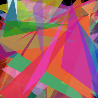
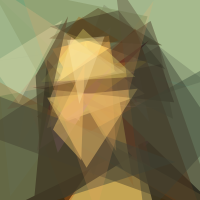
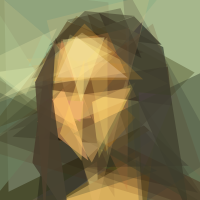
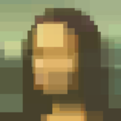

# How it works

"Modern Evolution Strategies for Creativity" {cite}`tian2021` uses Policy
Gradients with Parameter-based Exploration (PGPE) {cite}`sehnke2010` with the
ClipUp extension {cite}`toklu2020`.  The first thing to do is to understand how
PGPE works before going onto the shape fitting algorith.

:::{note}
The examples in this section use the same [Mona Lisa](https://github.com/google/brain-tokyo-workshop/blob/67c73645121d599f855714788db8a5c44e329c29/es-clip/assets/monalisa.png) image
from {cite}`tian2021`.
:::

## PGPE

The PGPE algorithm can be summarized as

1. Select a starting solution $\vec{x}$.
2. For $n$ iterations:
    1. Sample $k$ solutions from a normal distribution $N(\vec{x}, \Sigma)$.
    2. Compute the relative fitness $f(\vec{x}_k)$ of each sample $\vec{x}_k$.
    3. Compute an update $\Delta \vec{x}$ so that
       $f(\vec{x} + \Delta \vec{x}) > f(\vec{x})$.
    4. Let the next iteration solution $\vec{x}' = \vec{x} + \Delta \vec{x}$.

The specific details on how to implement PGPE, along with how to interpret the
various parameters, can be found in the ClipUP paper {cite}`toklu2020`.  The
[What is PGPE?](https://github.com/nnaisense/pgpelib/blob/d00907fe4b237e875ac0cc5b9d9c22591e4a7206/README.md#what-is-pgpe)
section of the [`pgpelib`](https://github.com/nnaisense/pgpelib) README has a
good example of how the algorithm works.

:::{seealso}
See the [](api/pgpe.rst) in the API documentation for how the
optimizer is implemented by 'abstractions'.
:::

## Fitting shapes to images

The algorithm is initialized by randomly generating $S$ shapes that will cover
the frame, all with random colours and dimensions.  The PGPE optimizer will then
generate a sets of $k$ candidate solutions to be rendered by [Blend2D](https://blend2d.com/),
a general-purpose 2D vector graphics engine.  The negative $L2$-norm between the
image generated from $\vec{x}_k$ and the orignal is then used as the fitness
(the negative is used because PGPE finds a maximum).

The example below shows what this looks like.  The optimizer will often converge
to a "good enough" solution very quickly and spend the bulk of its time
"fine-tuning".

:::{table} Generating an abstraction over 3000 iterations
| $n=1$ | $n=500$ | $n=3000$ | Original |
|-------|---------|----------|----------|
|  |  |  | 
:::

```{admonition} See the full optimization
:class: dropdown

:::{video} examples/monalisa-a1.mp4
:align: center
:width: 400
:::
```

### Other shape types

A key contribution by {cite:p}`tian2021` is recognizing that a set of shapes
can be describe as fixed-sized vectors.  The format is

:::{math}
\vec{x} = \begin{bmatrix}
    \vec{s} & \vec{c} \\
\end{bmatrix},
:::

where $\vec{s}$ is the set of shape parameters and

:::{math}
\vec{c} = \begin{bmatrix}
    r & g & b & a
\end{bmatrix}
:::

is the shape's RGBA colour vector.  For example, in {cite}`tian2021` (and in
'abstractions') triangles are represented by a triplet of 2D coordinates

:::{math}
\vec{s} = \begin{bmatrix}
    x_1 & y_1 & x_2 & y_2 & x_3 & y_3
\end{bmatrix}
:::

representing the vertices of a single triangle.

Since Blend2D is a general-purpose vector engine it supports a wide variety of
shapes.  It can quickly render a wide variety of shapes, not just triangles.
'abstractions' takes advantage of this to also support circles and rectangles
instead of just triangles.

:::{table} Generating an abstraction with different shapes.  All other parameters are the same.

| Rectangles | Circles |
|------------|---------|
|  |  |

:::

```{admonition} See how the optimization looks like for the two examples
:class: dropdown

:::{video} examples/monalisa-rects.mp4
:align: center
:width: 400
:::

:::{video} examples/monalisa-circs.mp4
:align: center
:width: 400
:::
```

Shapes can also be mixed together.  This can produce some different effects
since it allows the optimizer to place shapes that better match different
regions of the image.

:::{figure} examples/monalisa-circ-tri.png
An abstraction constructed using both circles and triangles.
:::

```{admonition} See the "circles + triangles" optimization
:class: dropdown

:::{video} examples/monalisa-circ-tri.mp4
:align: center
:width: 400
:::
```

## Rendering

The renderer converts a solution vector $\vec{x}$ into a set of Blend2D
operations.  Blend2D uses floating-point colour values so the colour components
$\vec{c}$ are always clamped to $[0, 1]$ prior to rendering.

The shape vector uses scale-free coordinate axes so that the top-left corner is
$(0,0)$ and the bottom-right corner is $(1,1)$.  These are converted into image
coordinates in a two-step process.  First all coordinates are rescaled so that
the minimum of an coordinate column is $0$ and the maximum is $1$.  Then they
are transformed by

:::{math}
\mathbf{T} =
1.2
\begin{bmatrix}
W-1 & 0  & 0 \\
0 & H - 1 & 0 \\
0 & 0 & 1 \\
\end{bmatrix}
\begin{bmatrix}
1 & 0 & -0.1 \\
0 & 1 & -0.1 \\
0 & 0 & 1
\end{bmatrix}
:::

The scaling by $1.2$ and shift by $-0.1$ are to allow shapes to be *slightly*
larger than the image.

### Alpha scaling

'abstractions' supports applying an alpha scale value $0 < \alpha_s \le 1$.
This is applied to the alpha channel just before it is clamped, i.e.,

:::{math}
A' = \mathrm{clamp}(\alpha_s A, 0, 1)
:::

This prevents shapes from becoming completely opaque and has the effect of
"softening" the image.  The example below shows the difference between
two different values of $\alpha_s$ *for the same PRNG seed*.

:::{table}
| $\alpha_s = 0.1$ | $\alpha_s = 1.0$ |
|------------------|------------------|
|  |  |
:::

```{admonition} See the optimization when $\alpha_s = 0.1$
:class: dropdown

:::{video} examples/monalisa-a01.mp4
:align: center
:width: 400
:::
```

### Limitations

There are some limitations when using multiple shapes in a single abstraction:

* The shapes are always rendered in the following order: circles, then
  rectangles, and then triangles.
* There is no way to individual control the number of shapes to use.  For
  example, 10 circles and 20 triangles.  Instead, the same number is used for
  all shape types.
